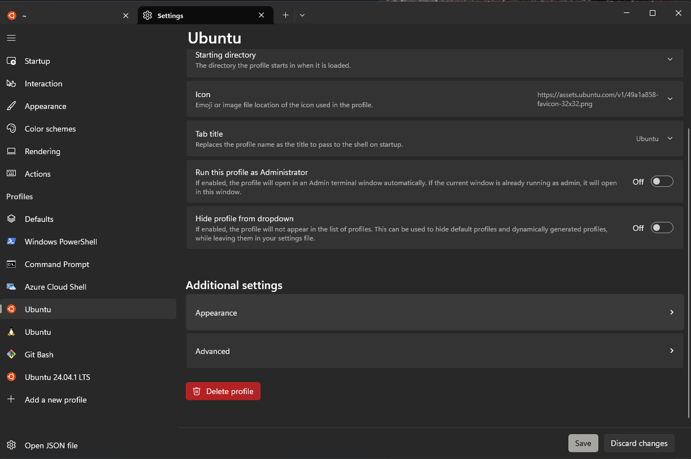

## Windows Step
Install WSL2 (Windows Subsystem for Linux). The following instructions are for
Windows11.

### Run in powershell as Administrator
```powershell
wsl --install -d Ubuntu
```

## WSL2 - Ubuntu Steps

### Install zsh shell with theme
This script automates the required packages and basic setup.
```bash
curl -sL https://raw.githubusercontent.com/viceo/wsl-ubuntu/refs/heads/master/setup.bash | bash
```

### Install rust
Install pre-requisite (build-essential) and perform default rust installation (enter when asked)
```bash
sudo apt install build-essential -y
curl --proto '=https' --tlsv1.2 -sSf https://sh.rustup.rs | sh
. "$HOME/.cargo/env" 
```

### Install eza
"ls" replacement
```bash
cargo install eza
echo "alias ls='eza -g'" >> $HOME/.oh-my-zsh/custom/aliases.zsh
```

### Start zsh
This will only be required the first time. Every subsequent wsl session will
load the configurations.
```bash
zsh
```

## Windows Terminal (APP)

### Open the Windows Terminal App
Search in the Windows Menu


### Go to settings 
Click on the dropdown and select settings (or CTRL + ,)


### Configure terminal startup
Update default profile to Ubuntu


### Configure Ubuntu profile
Select the Ubuntu profile and change appearance settings.


